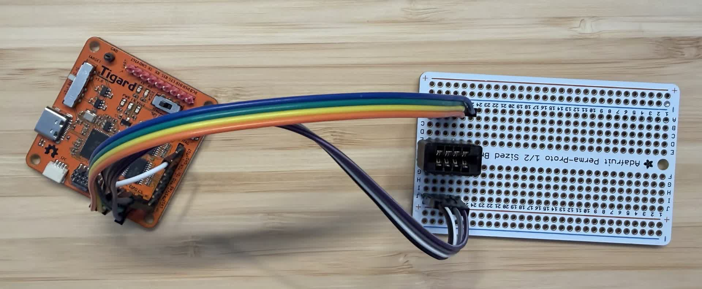
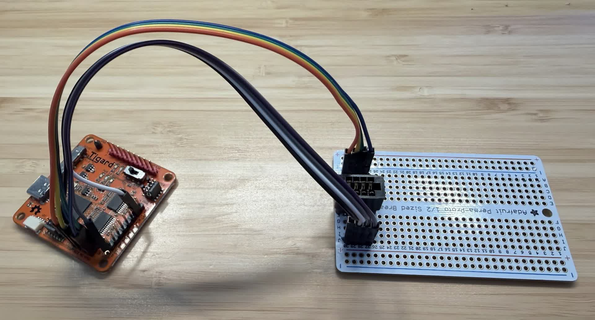
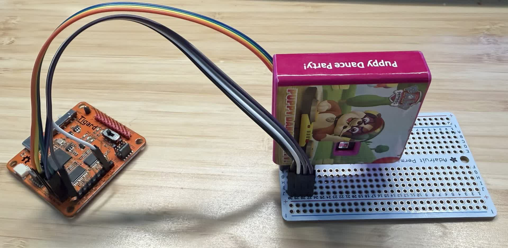

# Little Tikes Dream Projector Cartridge Reader


This is a stable, yet bare bones cartridge reader for the Little Tikes Dream Projector.

## Known Good Cartridges
See [Known Cartridges](known_cartridges.md)

## Software
* `pip install -r Requirements.txt`
* `python dump_spiflash.py` will generate a 1MiB `dump.bin` file with the contents of the SPI Flash
* The SPI Flash is read at 8MHz for a balance of speed and signal integrity
* Recommend running twice and comparing the two dumps, ie `shasum *.bin`
    * See the "Important" callout below for information on how to fix mismatching dumps

## Hardware
I used a [Tigard](https://1bitsquared.com/products/tigard) because I had one laying around, and I didn't need to write (much) code to do it. You should be able to use any `FT2232H` based board, although you'd have to figure out how to hook things up.

### Materials
 * Protoboard, such as [Adafruit Perma-Proto](https://www.adafruit.com/product/4353)
    * this one is nice since the rows are connected together on each side of the middle like on a breadboard, so it saves a bit of soldering
 * A FT2232H-based interface board such as [Tigard](https://1bitsquared.com/products/tigard)
 * Socket-to-Socket Dupont wires such as [360-Pc Multicolor Breadboard Jumper Wires Kit - 30/20/10cm Dupont Cables (MF/MM/FF) for Arduino, Raspberry Pi](https://www.amazon.com/360-Pc-Multicolor-Breadboard-Jumper-Wires/dp/B089FZ79CS)
 * Qty 2 of 4-pin 2.54mm header, such as [Break Away Headers 2.54 mm Male Pin Header Connector - 40-pin Male Long Centered (Pack of 10)](https://www.amazon.com/DIKAVS-Break-Headers-Header-Connector/dp/B076F64ZCJ)
 * 8-Pin 2.54mm pitch card edge connector (like an old computer's ISA slot), such as [PATIKIL Card Edge Connector Black Socket Straight Connection 8 Pin 2.54mm Pitch for PCB Circuit Board, Game Console, Pack of 5](https://www.amazon.com/dp/B0BPP6SVRD)
 * Soldering iron and supplies

### Building a reader
* install the 8-pin cartridge socket in the middle of your protoboard
* install the 4-pin 2.54mm headers to either side of the cartridge socket
* solder the headers
* ensure that the socket pins are connected to the header pins
    * will be done for you if you use Adafruit Perma-Proto or similar
    * otherwise, solder a bit of wire between the header pins and their corresponding socket pins
* ensure that the cartridge socket pins are not connected to each other
    * for example if using protoboard with connections on the backside (ensure there is a gap between the two rows of socket pins)
* If using an Adafruit Perma-Proto, you may need to bend the pins slightly out from their original position to fit it over the middle gap.



Once the reader board is built, wire it up to your interface board of choice.

If using a Tigard:
 * Set `JTAG/SPI  <-> SWD/I2C` switch to `JTAG/SPI`
 * Set `Target (voltage)` to `3.3v`
 * Connect Dupont wires to the 2x4-Pin `SPI header`
 * Connect `GND_SENSE` wire to another pin labelled `GND` on the Tigard

### Cartridge pinout
With the cartridge label facing down:
```
+-------+        +-----------+  1  2   3   4
|       |        |  1 2 3 4  | SO nCS SCK SI
|       |        | -=-=-=-=- |
|       +--------+  5 6 7 8  | VCC VCC_SENSE GND_SENSE GND
+----------------------------+  5     6          7      8
```



> [!NOTE]
> `GND_SENSE` is connected to `GND` physically on the cartridge. 
>
> `VCC_SENSE` is connected to `VCC` physically on the cartridge. 
>
> These are likely used in tandem to determine when a cartridge is fully inserted

> [!IMPORTANT]
> I left `GND_SENSE` and `VCC_SENSE` disconnected initially, but ran into signal integrity issues (dumps of the same cartridge were not identical).
>
> To solve this, I connected `GND_SENSE` to another `GND` point on my interface board and this solved the issues and each dump of the same cartridge became identical.
>
> (I did not connect `VCC_SENSE`, although it is safe to do so)

> [!IMPORTANT]
> When running the dumper software on Windows with a FT2232H based board, you will need to re-assign the driver to `libusb-win32`
>
> Ensure that `Options->Ignore Hubs or Composite Parents` is *unchecked*
>
> Select `<device name> (Composite Parent)' and 'libusb-win32' (even on 64-bit OS) and click `Replace Driver` - this will take a few minutes
