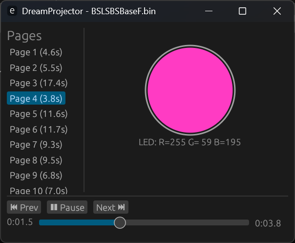

# Dreamsmith

This project contains the following tools:
 * `dreamsmith` - a tool to parse and dump the structure of a story cartridges
 * `dreamprojector` - a GUI tool to play audio and display its lightshow

## Dreamsmith
A CLI program to display infomation about a cartridge image, extract audio and LED animations, and build a new cartridge from audio and LED animations

Usage:
 * `dreamsmith info <file>` - dumps information about the contents of a cartridge image
 * `dreamsmith extract <file> [--out-dir <directory>]` - extracts the Audio, LED animations, and sound effects to the current directory, or one that's specified
 * `dreamsmith build <dir> [-out <output.bin] [-id <32 character hexadecimal string>]` - builds a new cartridge image based on `Audio_XX.wav`, `Audio_XX.led`, `Effect_XX.wav`, and `id.bin` files from the specified directory. `-id` option takes precedence over the `id.bin` file when both are supplied.

## Dreamprojector
Plays Audio and visualized LED animations from a cartridge image.

